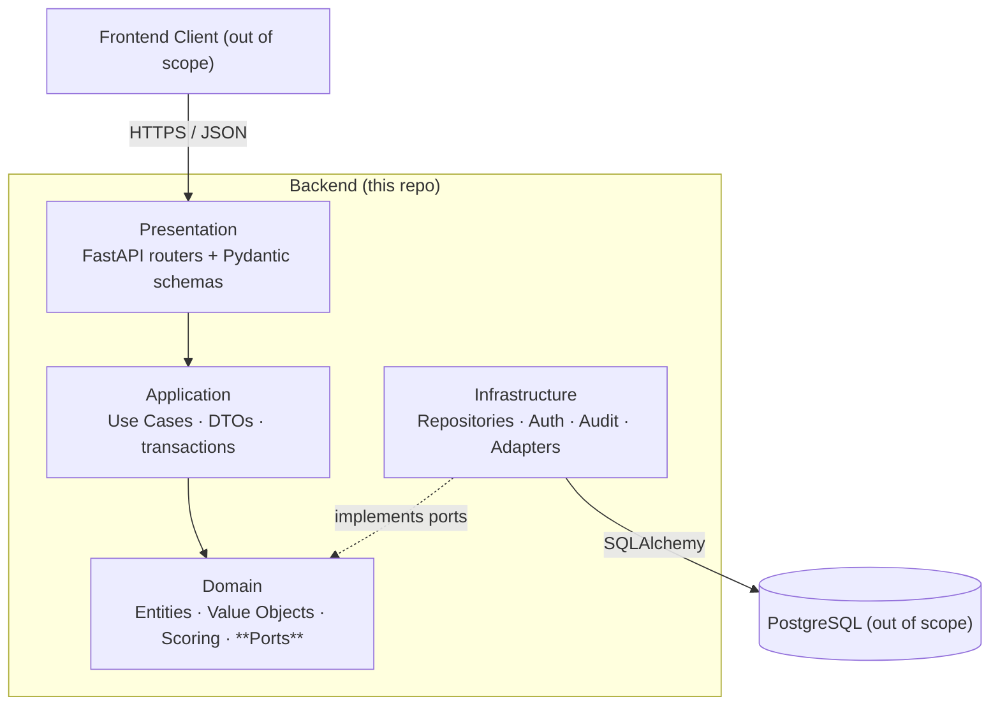

# ADR-001 — Backend Architecture & Project Context

> **Status:** Accepted · **Date:** 2026-05-02 · **Scope:** Whole backend foundation

## 1. Business Context

The **SXFp** project provides a digital platform for Brazilian physicians to
triage, diagnose, and route patients with suspected **Fragile X Syndrome (FXS)** —
a genetic condition with significant under-diagnosis in Brazil. The backend
ingests structured **anamnesis forms** (phenotypic, family, behavioural
checklists), runs a deterministic **symptom-scoring engine**, and emits
**clinical decision support (CDS)** alerts such as *"recommend genetic testing"*
or *"route to occupational therapy"*.

Patient data here qualifies as sensitive personal data under [[LGPD]]
(Lei nº 13.709/2018), the Brazilian counterpart to GDPR's "special category"
data. Every architectural choice in this document must remain compliant.

## 2. Backend Scope (vs. Partner Teams)

| Owner | Responsibility |
|---|---|
| **Backend (this repo)** | Domain logic, REST API, scoring engine, audit, app-level security |
| Frontend team | UI/UX, web client, accessibility |
| DBA team | PostgreSQL schema, migrations, indexes, backups, encryption-at-rest |

Therefore the backend must expose **stable, documented contracts** — Pydantic
schemas, DTOs and ports — so that both peer teams can plug in without coupling
to our internals. See [[005_Integration_Contracts_DTOs]].

## 3. Decision Drivers

- **Compliance:** LGPD, ANPD guidelines, Brazilian Ministry of Health recommendations.
- **Performance:** p95 < 2 s for clinical endpoints (NFR).
- **Maintainability:** Long-lived clinical software, small team, frequent rule updates.
- **Decoupling:** Database engine and frontend client are external; both must be
  swappable without rewriting business rules.
- **Auditability:** Every read/write of patient data must be traceable.
- **Tooling parity:** Frontend team needs an OpenAPI spec from day one.

## 4. Architectural Decisions

### 4.1 Framework — **FastAPI**

- ASGI-based, async-first, very high throughput.
- Native Pydantic v2 → request/response validation + automatic **OpenAPI 3.1**
  generation (the frontend team can mock against it immediately).
- Dependency-injection system (`Depends`) maps cleanly onto **Ports & Adapters**.
- Detailed comparison vs. Flask/Django REST in [[002_Framework_Selection_FastAPI]].

### 4.2 Architectural Style — **Hexagonal (Ports & Adapters)**

- **Domain** core is pure Python — no FastAPI, no SQLAlchemy imports allowed.
- **Application** layer orchestrates use cases through ports.
- **Infrastructure** provides adapters (DB, hashing, audit sink, email).
- **Presentation** exposes HTTP via FastAPI routers.
- Inversion of Control through FastAPI's `Depends()` + a small composition root.
- See [[003_Hexagonal_Architecture_Strategy]].

### 4.3 Contract-First Integration

- **Pydantic schemas** in `app/presentation/api/v*/schemas/` are the source of
  truth for the frontend (rendered as OpenAPI).
- **Domain entities + Ports** define what the persistence team must satisfy.
- **DTOs** in `app/application/dtos/` carry data across layer boundaries
  without leaking ORM rows or HTTP payloads through the domain.
- See [[005_Integration_Contracts_DTOs]].

### 4.4 Security & LGPD Strategy

- **Authentication:** OAuth2 password-flow → **JWT (RS256)** with role claim
  `doctor`; access tokens short-lived, refresh tokens stored hashed.
- **Authorization:** Role-based via FastAPI dependency; the only authorised
  role at v1 is `doctor`.
- **PII masking:** A `PIIMaskingMixin` on response schemas (or
  `field_serializer`) redacts CPF, full names and addresses *before* the
  payload reaches the wire. The statistics endpoint always returns
  pseudonymised aggregates.
- **Audit middleware:** Captures `(actor_id, action, resource, request_id,
  timestamp, ip)` for every state-changing request; persists asynchronously
  through an `IAuditSink` port. See [[007_Audit_Logging_Middleware]].
- **Encryption-at-rest** is owned by the DBA team (pgcrypto / TDE).
  **Encryption-in-transit** is enforced at the load balancer (HTTPS only).
  Backend hashes passwords with **Argon2id** via `passlib`.
- See [[006_LGPD_PII_Strategy]].

## 5. Trade-offs Considered

| Option | Chosen? | Reason |
|---|---|---|
| **Flask** | ❌ | No native async, manual OpenAPI, weaker validation. |
| **Django REST** | ❌ | Couples ORM and framework; heavier than needed. |
| **FastAPI** | ✅ | Async, OpenAPI, Pydantic, lightweight. |
| **MVC monolith** | ❌ | Mixes UI/data concerns we explicitly want isolated. |
| **Hexagonal** | ✅ | Explicit ports → swappable DB & UI, testable domain. |
| **Microservices** | ❌ | Premature; team size and domain do not justify it yet. |

## 6. Consequences

**Positive**

- Domain logic is testable with no FastAPI / Postgres running.
- Frontend can mock against the OpenAPI spec from day one.
- DBA team implements repositories against fixed port signatures.
- LGPD obligations become a *layer*, not a sprinkle of ad-hoc checks.

**Negative / costs**

- More indirection (ports, adapters, DTOs) → small overhead for trivial CRUD.
- Requires team discipline so that infrastructure imports never leak into the
  domain. Enforced via `ruff` import-linter rules in [[004_Directory_Structure]].

## 7. First Implementation Steps (executed)

1. ✅ `pyproject.toml` + dependency baseline.
2. ✅ `app/core/config.py` — typed settings via `pydantic-settings`.
3. ✅ `app/main.py` — FastAPI factory with `/health` endpoint.
4. ✅ Empty package skeleton mirroring the chosen architecture.
5. ⏭ Subsequent ADRs starting at [[002_Framework_Selection_FastAPI]].

## 8. Open Questions (deferred to follow-up ADRs)

- Token format: JWT vs. opaque token + Redis? → [[008_AuthN_Strategy]].
- Audit sink: same DB vs. append-only log (e.g. WORM bucket)? → [[007_Audit_Logging_Middleware]].
- Scoring rules versioning & rollback strategy. → [[009_Scoring_Engine_Design]].
- Statistics anonymisation: k-anonymity threshold *k*? → [[010_Statistics_Anonymisation]].

## 9. References

- LGPD — Lei nº 13.709/2018.
- Hexagonal Architecture, Alistair Cockburn (2005).
- *Clean Architecture*, Robert C. Martin.
- FastAPI documentation — fastapi.tiangolo.com.
- ANPD — Guia de Boas Práticas LGPD para o setor de saúde.

## 10. Tags

#adr #architecture #foundation #hexagonal #fastapi #lgpd #python #sxfp
