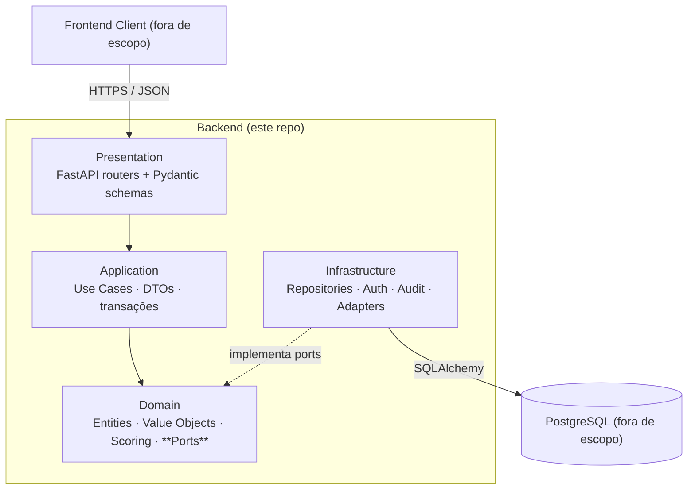

# ADR-001 — Arquitetura do Backend & Contexto do Projeto

> **Status:** Aceito · **Data:** 2026-05-02 · **Escopo:** fundação completa
> do backend

## 1. Contexto de Negócio

O projeto **SXFp** entrega uma plataforma digital para que médicos
brasileiros façam triagem, diagnóstico e roteamento de pacientes com
suspeita de **Síndrome do X Frágil (FXS)** — uma condição genética com
significativa subdiagnóstico no Brasil. O backend recebe **formulários
de anamnese** estruturados (checklists fenotípico, familiar e
comportamental), executa um **motor de scoring de sintomas**
determinístico e emite **alertas de suporte à decisão clínica (CDS)**
como *"recomendar teste genético"* ou *"encaminhar à terapia
ocupacional"*.

Dados do paciente aqui se qualificam como dados pessoais sensíveis sob a
[[br_LGPD]] (Lei nº 13.709/2018), o equivalente brasileiro à categoria
"especial" da GDPR. Toda escolha arquitetural neste documento precisa
permanecer compliant.

## 2. Escopo do Backend (vs. Times Parceiros)

| Owner | Responsabilidade |
|---|---|
| **Backend (este repo)** | Lógica de domínio, REST API, motor de scoring, auditoria, segurança em nível de app |
| Time de frontend | UI/UX, web client, acessibilidade |
| Time de DBA | Schema PostgreSQL, migrações, índices, backups, encryption-at-rest |

Portanto o backend precisa expor **contratos estáveis e documentados**
— schemas Pydantic, DTOs e Ports — para que ambos os times parceiros
conectem sem acoplar nossas internas. Ver [[br_005_Integration_Contracts_DTOs]].

## 3. Drivers de Decisão

- **Compliance:** LGPD, diretrizes da ANPD, recomendações do Ministério
  da Saúde.
- **Performance:** p95 < 2s para endpoints clínicos (NFR).
- **Manutenibilidade:** software clínico de longa duração, equipe pequena,
  atualizações frequentes de regra.
- **Desacoplamento:** o engine de banco e o cliente frontend são
  externos; ambos precisam ser substituíveis sem reescrever as regras de
  negócio.
- **Auditabilidade:** toda leitura/escrita de dados de paciente precisa
  ser rastreável.
- **Paridade de tooling:** o time de frontend precisa de uma spec
  OpenAPI desde o dia 1.

## 4. Decisões Arquiteturais

### 4.1 Framework — **FastAPI**

- Baseado em ASGI, async-first, throughput muito alto.
- Pydantic v2 nativo → validação de request/response + geração
  automática de **OpenAPI 3.1** (o time de frontend pode mockar contra
  ela imediatamente).
- Sistema de dependency injection (`Depends`) mapeia limpamente em
  **Ports & Adapters**.
- Comparação detalhada vs. Flask/Django REST em
  [[br_002_Framework_Selection_FastAPI]].

### 4.2 Estilo Arquitetural — **Hexagonal (Ports & Adapters)**

- O **Domain** core é Python puro — sem imports de FastAPI nem
  SQLAlchemy.
- A camada de **Application** orquestra casos de uso através de ports.
- A **Infrastructure** fornece adapters (DB, hashing, audit sink, email).
- A **Presentation** expõe HTTP via routers FastAPI.
- Inversion of Control via `Depends()` do FastAPI + um composition root
  pequeno.
- Ver [[br_003_Hexagonal_Architecture_Strategy]].

### 4.3 Integração Contract-First

- **Schemas Pydantic** em `app/presentation/api/v*/schemas/` são a fonte
  da verdade para o frontend (renderizados como OpenAPI).
- **Domain entities + Ports** definem o que o time de persistência tem
  que satisfazer.
- **DTOs** em `app/application/dtos/` carregam dados entre fronteiras
  sem vazar linhas ORM ou payloads HTTP pelo domínio.
- Ver [[br_005_Integration_Contracts_DTOs]].

### 4.4 Estratégia de Segurança & LGPD

- **Autenticação:** OAuth2 password-flow → **JWT (RS256)** com claim de
  papel `doctor`; access tokens curtos, refresh tokens armazenados
  hasheados.
- **Autorização:** RBAC via dependency FastAPI; o único papel
  autorizado em v1 é `doctor`.
- **Mascaramento PII:** `PIIMaskingMixin` em schemas de resposta (ou
  `field_serializer`) redige CPF, nomes completos e endereços *antes*
  do payload chegar à wire. O endpoint de estatísticas sempre devolve
  agregados pseudonimizados.
- **Audit middleware:** captura `(actor_id, action, resource,
  request_id, timestamp, ip)` para toda requisição que muda estado;
  persiste assincronamente através de uma port `IAuditSink`. Ver
  [[br_007_Audit_Logging_Middleware]].
- **Encryption-at-rest** é responsabilidade do time de DBA (pgcrypto /
  TDE). **Encryption-in-transit** é forçada no load balancer (HTTPS
  apenas). O backend hasheia senhas com **Argon2id** via `passlib`.
- Ver [[br_006_LGPD_PII_Strategy]].

## 5. Trade-offs Considerados

| Opção | Escolhida? | Motivo |
|---|---|---|
| **Flask** | ❌ | Sem async nativo, OpenAPI manual, validação fraca. |
| **Django REST** | ❌ | Acopla ORM e framework; mais pesado que o necessário. |
| **FastAPI** | ✅ | Async, OpenAPI, Pydantic, leve. |
| **Monolito MVC** | ❌ | Mistura UI/data que queremos isolar. |
| **Hexagonal** | ✅ | Ports explícitos → DB e UI substituíveis, domínio testável. |
| **Microsserviços** | ❌ | Prematuro; tamanho da equipe e do domínio não justificam. |

## 6. Consequências

**Positivas**

- Lógica de domínio é testável sem FastAPI / Postgres rodando.
- Frontend pode mockar contra a spec OpenAPI desde o dia 1.
- Time de DBA implementa repositories contra assinaturas de port fixas.
- Obrigações LGPD viram uma *camada*, não checks ad-hoc espalhados.

**Negativas / custos**

- Mais indireção (ports, adapters, DTOs) → pequeno overhead para CRUD
  trivial.
- Exige disciplina do time para que imports de infraestrutura nunca
  vazem para o domínio. Aplicado via regras `import-linter` listadas em
  [[br_004_Directory_Structure]] *(planejado)*.

## 7. Primeiros Passos de Implementação (executados)

1. ✅ `pyproject.toml` + baseline de dependências.
2. ✅ `app/core/config.py` — settings tipadas via `pydantic-settings`.
3. ✅ `app/main.py` — factory FastAPI com endpoint `/health`.
4. ✅ Esqueleto de packages vazios espelhando a arquitetura escolhida.
5. ⏭ ADRs subsequentes começando em
   [[br_002_Framework_Selection_FastAPI]].

## 8. Questões em Aberto (deferidas para ADRs subsequentes)

- Formato de token: JWT vs. token opaco + Redis? → [[br_008_AuthN_Strategy]].
- Audit sink: mesmo DB vs. log append-only (ex.: WORM bucket)? →
  [[br_007_Audit_Logging_Middleware]].
- Versionamento e estratégia de rollback do scoring. →
  [[br_009_Scoring_Engine_Design]].
- Anonimização de estatísticas: limiar de k-anonymity *k*? →
  [[br_010_Statistics_Anonymisation]].

## 9. Referências

- LGPD — Lei nº 13.709/2018.
- Hexagonal Architecture, Alistair Cockburn (2005).
- *Clean Architecture*, Robert C. Martin.
- Documentação do FastAPI — fastapi.tiangolo.com.
- ANPD — Guia de Boas Práticas LGPD para o setor de saúde.

## 10. Tags

#adr #architecture #foundation #hexagonal #fastapi #lgpd #python #sxfp #pt-br
